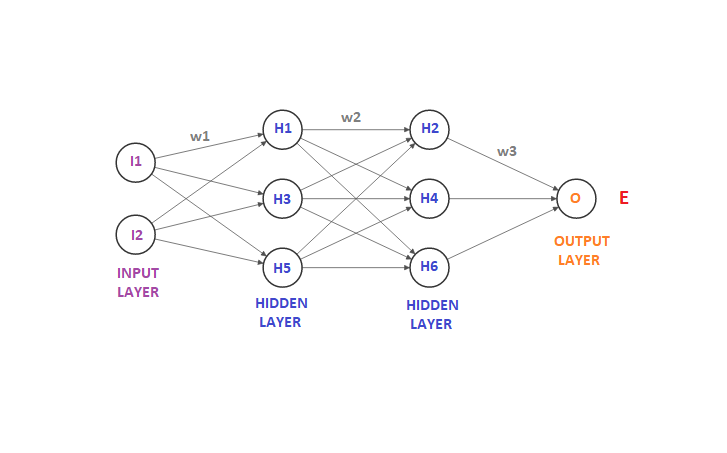
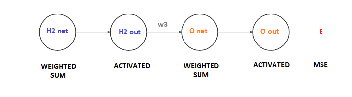
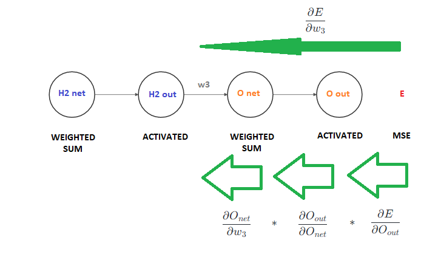
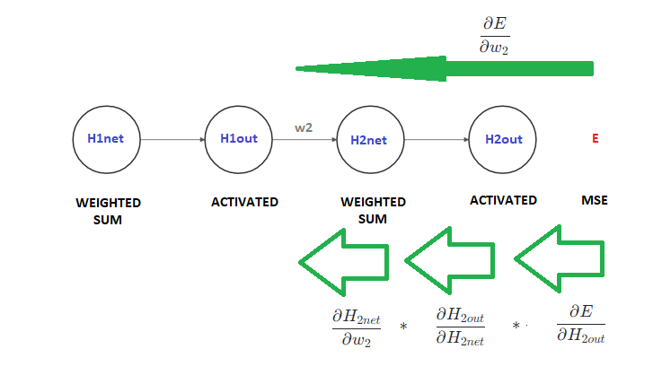
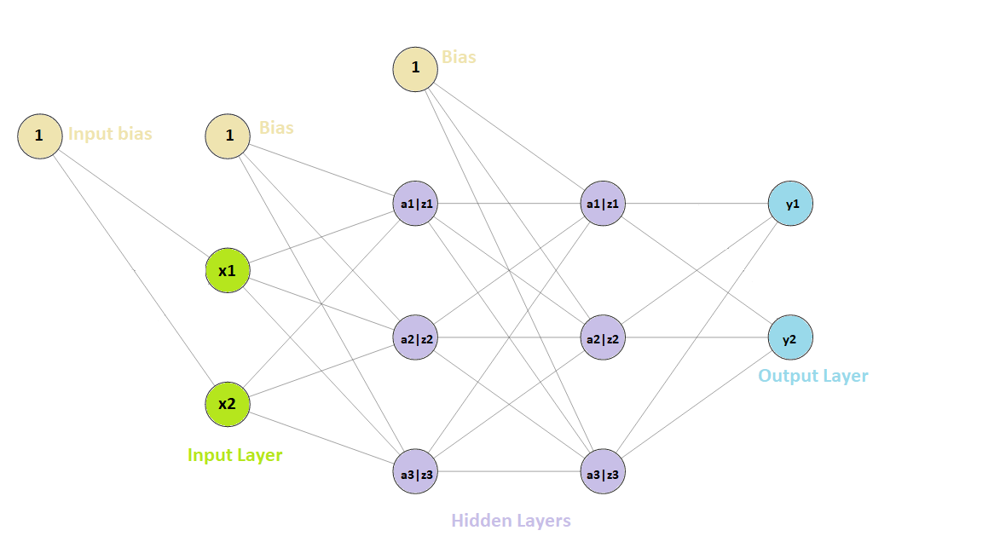
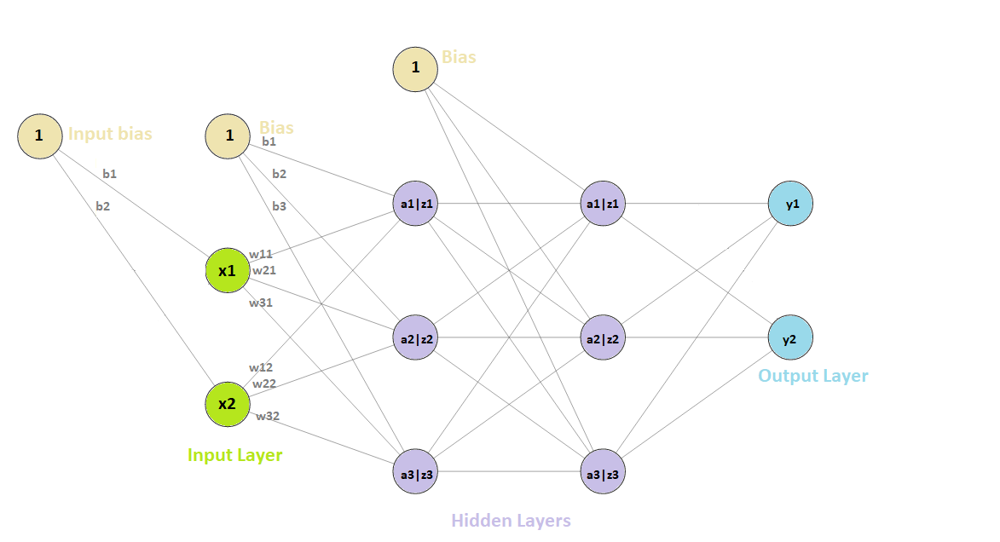

# My AI notes and remarks

This file contains notes, remarks collected in years and years. I had to refresh some concepts and theory before doing this fun project. Hope this short tutorial will help you to understand AI and deep learning better. 

This is a learn-by-doing tutorial and every step of project is there documented and explained in detail, with math and theory.

## Basics - theory

Artificial Intelligence (AI) is a way to make a computer acting like a human. Of course, a program can always be written. For example I can write a program to do a simple sum *a+b* with just an instruction. However this is not intelligence because I am telling the computer what I want and the computer is doing that. Nothing else.

We have learned what a sum is when children, counting with fingers. Would it be possible a computer doing that like us?

Our brain is, essentialy, a sort of *elecrtonic processor*. Neurons are connected each other by *synapsis* and electric signals are sent between one and the other neuron through those connections. If a neuron is *activated* from incoming electric signals (mV, millivolts) then an electric signal is produced and propagated through the other connections. 


*Image from Wikipedia*

Such model can be easly converted in a program and the electric processes behind can be enough well translated into math. 

## Machine learning

One way to learn a computer how to solve problems is through Neural Networks (it is not the only way, but I think the most interesting one!).

Essentialy a Neural Network (NN) is a program that acts like neurons connected each other and **simulating** the human thinking/learning. In fact a neural network can *adjust* itself internal calculations in order to produce the expected results.

Given an input the network will try to produce an output. The output is just a series of calculations (computers are good in that!) that could be right or not.

Those results are then measured (compared to an expected value) and error is calculated. If error is more than a desidered threshold, this information is *"sent back"* in the program in order to produce a better calculation/result.

Doing that for many, many times (**epochs**) will led to an enough precise result (error is lower each time).

Essentialy the computer, providing a good program, could reproduce our way of learning things. In fact we learn, for example, what a cat is and then we are able to say "*yes this is a cat*". Then we can learn what is a Siamese cat and distinguish Siamese from Russian Blue for example. But this is done step-by-step (in fact, if we would not be able to say what a cat is, would be very difficult to say if this is a Siamese).

Through a computer program we have to give, for example, a cat image as input. The output should be "yes" or "no" (is a cat or not classification). But we do not want to write each single line of code to recognize a cat or hash all world's cat pics to a big dictionary with yes/no answers. 

We'd like to write a particular algorithm that given any pic as input will produce yes/no as output and that this algorithm will **automatically** adjust itself in order to learn what a cat is. Then, when we are satistfacted, this **model** of calculations can be used with all images we like. We are not interested in telling the computer what a cat is but we aim to teach the computer how a cat can be recognized.

This is, essentialy, machine learning: computer will be able to learn and adjust its knowledge itself. This can be done with statistics, math, and many other ways. But the most interesting one is Neural Networks, algorithms capable to simulate human brain.

## What is a Neural Network (NN)

### Basics

Neural Network concept is creating a data structure with neurons connected each other. Neurons wait for our input and calculations inside the network will produce an output. 

Like explained before, a neuron is a "unit" connected to other neuros. Neuros can be active or not and its signals are sent as millivolts to other neuros. Other neurons take those input signals and they can activate or not. And so on... million and million times.

Translating that into informatics: we have a set of neurons (a **layer** of neurons). They take an input and have connections to other neurons (**synapsis**). Input is translated into electric signal (**weighted**) and basing on that value, through an **activation function** the neuron output is (sent) **propagated** to the other layers. 

The first layer is the **input layer** (where we define one or more input for the network), then one (or more) **hidden layers** of neurons (may be **fully connected**) elaborate inputs and produces an output for the next layer. The final layer is the **output layer** (that could be one or more).

Simple network:


*image from https://miro.medium.com*

A neural network without any hidden layer (so only input and output) is called **Perceptron**
A neural network with more than one hidden layer is called **Deep Neural Network (DNN)** and, as the name states, is used in the **Deep Learning**.

Translating it into simple informatics, a neuron "value" (the circles) can be C++ *objects*. Each object is connected to others (*pointers*). There will be a "value" (*double*) calculated by a function (*activation function*) and this value will be sent through connections to the other neurons. Of course the sent value could not be the same in each connection and to obtain this we can add a factor called **weight** (another *double*).

In schematics:


*image from https://miro.medium.com*

So, this is easy to translate in C++, you can find it in the [header file](components/briand_ai/include/BriandNN.hxx)

Generally, if we have a neuron $O$ receiving inputs from $n$ neurons having value of $I$ its "value" (output of the connected neurons) is  given by the easy formula of weighted sum:

$$ O = w_{1} * I_{1} + w_{2} * I_{2} + w_{3} * I_{3} + ... + w_{n} * I_{n} $$

Where:

 - $i$ is the neuron $i$ of $n$
 - $w_{i}$ is the weight assigned to the connection $i$
 - $I_{i}$ is the "value" of the neuron $i$

But... if all weights or inputs in a certain moment are all zero? The sum will be zero. And this 0 will be **propagated** to all other, making always output equal to zero. How to avoid this? It's simple, we can add a **bias** in one, two, or all layers (excluding output layer). A bias is a "standalone" neuron who has no inputs but is fully connected to all other neurons in the layer he lies.


*image from https://miro.medium.com*

So, the $O$ value calculation changes to:

$$ O = w_{1} * I_{1} + w_{2} * I_{2} + w_{3} * I_{3} + ... + w_{n} * I_{n} + w_{b} * b $$ 

Where:

 - $i$ is the neuron $i$ of $n$
 - $w_{i}$ is the weight assigned to the connection $i$
 - $I_{i}$ is the "value" of the neuron $i$
 - $b$ is the bias value

Sometimes bias has no weight associated and it is a fixed value marked with just $b$.

### Activation

The output value of the weighted sum could not be good for calculations and neuron values could be very variable. Biologically, if the signal is higher than a mV (millivolts) threshold the neuron is meant to be activated (in informatics we have a binary 1) but if this not happens then neuron is not activated (in informatics we have a binary 0). So we need some way to "flattern" neuron values to what is easy to be recognized as "active" or "inactive", or better, have a good "step". This can be done with simple math functions like **sigmoid** function. Of course, many other can be used also for performances. 

So, neuron "value" calculated with the weighted sum must be the argument of the **activation function**. We can write as:

$$ Oact = f( O ) = f( w_{1} * I_{1} + w_{2} * I_{2} + w_{3} * I_{3} + ... + w_{n} * I_{n} + w_{b} * b ) $$

The type of the $f$ function is not a guess, there are some rules to follow for good NN programming.

In project there are the following activation functions (see [header source](components/briand_ai/include/BriandMath.hxx))

#### Sigmoid (Logistic curve)

$$ Sigmoid(x) = { 1 \over 1 + e^{-x} } $$


*image from Wikipedia*

Sigmoid is widely used in neural networks.

#### ReLU

ReLU (**Re**ctified **L**inear **U**nit) is a simple function used (mostly) in hidden layers neuron activation. It is a rectified value:

$$ ReLU(x) = MAX(0, x) $$

So, if $x \gt 0$ then output of $ReLU(x) = x$ otherwise $ReLU(x) = 0$.

#### Other

Other functions that you can often find in NN are: $tanh$ and $softmax$.

#### How to choose activation function

Generally, follow this rule:

 - ReLU should be avoided everywhere but in hidden layers (because it is "restrictive")
 - In hidden layers never use sigmoid because of the *vanishing gradients* problem
 
So in hidden layers ReLU will be used in project, in the others sigmoid.

### Forward propagation

Now that the data structure is ready, we need to understand how data is propagated from inputs to output (**forward propagation**) with the weighted sum. This is done in project by calculating, starting from the first hidden layer (or the output layer if no hidden layer is defined) the value of each Neuron by calling the ``UpdateValue`` method. 
This method simply reads the ``Inputs`` vector synapsis. Foreach input, multiplied by the Weight, the sum is saved and then the activation function applied. 

This is done starting from the frist layer from the left till the output layer in the right.

When output is ready the **error** can be calculated respect to the **target** output (expected output). For example if output is 1 but we would expect a value of 2 then the error can be calculated.

To calculate the error there are many formulas can be used, however the most used in NN is the Mean Squared Error (**MSE**). Formula (one output, one target) is:

$$ MSE = {1 \over 2} * ( Target - Output )^2 $$

(the $1 \over 2$ factor simplifies next calculation, just accept it as is by now).

### Deep Neural Networks

It seems a difficult term, but the concept is very very easy: while a Perceptron has no hidden layer, a Neural Network has 1 hidden layer. Where there is more than one hidden layer the network is called *Deep* Neural Network.

---
**&#x1F44B; Find it in the project!**</span>

Math functions: [BriandMath.hxx](components/briand_ai/include/BriandMath.hxx) and [BriandMath.cpp](components/briand_ai/BriandMath.cpp). Math functions can be used then in all NN sources, by defining pointer type:

```C++
using ActivationFunction =  double (*)(const double& x); // Pointer to an activation function
using ErrorFunction =  double (*)(const double& target, const double& output); // Pointer to an error calculation function
```

NN basic classes in [BriandNN.hxx](components/briand_ai/include/BriandNN.hxx) and [BriandNN.cpp](components/briand_ai/BriandNN.cpp)

```C++
class Neuron; // This is a neuron. It has its value and all inputs synapsis from other neurons in the network. A method of UpdateValue does the value calculation.

class Synapsis; // This is the neuron "link". It connects the Source neuron to the current neuron with a Weight.

class NeuralLayer; // This is an array of neurons. Each layer has a type (input, output, hidden...) and they share the activation function. UpdateNeurons calls UpdateValue for each network in the layer.

class NeuralNetwork; // This is a basic Neural Netowork structure. Every NN has 1 input layer, 0 or more hidden layers, 1 output layer. The PropagateForward method does the forward propagation

class Perceptron; // A perceptron NN. Has one input and output layer.
```

---

### Neural network types

Here I paste some very nice images about common neural network types. 

Not all are covered by the project, but some are very interesting and funny. Foreach NN type I will place there some of the common use.

You can find a (mostly) comprehensive chart [here](https://i.stack.imgur.com/0WL34.jpg), follows details for NN used in project *source: [towardsai.net](https://towardsai.net/p/machine-learning/main-types-of-neural-networks-and-its-applications-tutorial-734480d7ec8e)*.

#### Feed Forward (FF):

Applications:

 - Data Compression.
 - Pattern Recognition.
 - Computer Vision.
 - Sonar Target Recognition.
 - Speech Recognition.
 - Handwritten Characters Recognition.


#### Deep Feed-forward (DFF):

Applications:

 - Data Compression.
 - Pattern Recognition.
 - Computer Vision.
 - ECG Noise Filtering.
 - Financial Prediction.


#### Deep Convolutional Network (DCN):

Applications:

 - Identify Faces, Street Signs, Tumors.
 - Image Recognition.
 - Video Analysis.
 - NLP.
 - Anomaly Detection.
 - Drug Discovery.
 - Checkers Game.
 - Time Series Forecasting.


#### Support Vector Machines (SVM):

Applications:

 - Face Detection.
 - Text Categorization.
 - Classification.
 - Bioinformatics.
 - Handwriting recognition.


## Machine Learning with Neural Network

So, at this point you should have in mind the structure and architecture of a Neural Network, how inputs are given and how output is generated. However this is nothing else than a simple and easy calculation (even wrong most of time). You also may have in mind some questions like *how to choose right weights values?* or *which bias value should I set?*. Well answer is just this: **do not worry, your computer will find the right ones itself**. What!? How is this possible? 

This process is just a series of math equations done once, twice and so on for a long time of **epochs** in order to let the computer find by itself the right values. This process is called **training** and the core of the training and the **learning** process is the **backpropagation**.

### Backpropagation (intro and concepts)

We discussed about *forward* propagation where input layer values are driven through the network to the output layer. When we have our output we can calculate an error (remember, the $MSE$) given the expected target value.

This error tells us *how much* we are wrong. We would like to communicate to each neuron of the previous layer this error in order to adjust each synapsis weight to obtain a lower error. Then, should do the same for the previous layer again and again till reaching the input. After that all weights will be updated (we don't have to worry about neuron's value because they depend on weights). If we can translate this into math equations then we can "teach" to our NN how to *self-adjust* or *learn from error*.

Done that, a forward propagation with updated weights will give a more precise output (with a lower error). We can repeat the process ($epoch$ times) until the error is as low as zero. 

This method found its base on the **gradient descent** algorithm. The idea is very simple: we would like a costant lower error at each epoch, this can be done with the math: in fact, the *derivative* of any fuctions tells us when the function is getting higher or lower and when zero, it is a (local) minimum. So we can use that to find the lowest possible error. 

In the case of a single neuron output layer, given a target output $T$, the current output $O$, in order to calculate the error we use the $MSE$ formula:

$$ MSE = {1 \over 2} * ( T - O )^2 $$

Then we want to know *how much* of that error is related to each previous-layer synapsis in order to change the weight and get a lower error. We define also that the new weight $\overline w$ is given by this formula:

$$ \overline w = w - \eta * \displaystyle \frac{\partial MSE}{\partial w} $$

*Note: here we use MSE as error calculation but other methods could be used!*

*Note 2: here I used just one output neuron. If more output neuros, simply calculate error for each one and the total error as the sum of all errors. The steps following must always refer to the total error.*

Explained: the new weight will be equal to old weight less than the *magnitude* of the current weight on the error, multiplied by a factor of $\eta$ (the **learning rate**). In other words, we'd like to know how much the weight *affects* the total error in order to correct it to a lower rate. We will have more chanches to "guess" it faster if a factor of $\eta$ is well "guessed". 

The $\frac{\partial MSE}{\partial w}$ is the (partial) **derivative** of the error respect to the weight (or the *gradient* of $MSE$ respect to $w$).

#### Concepts - Backpropagation at output layer

The main "problem" in solving the equation is that the weight $w$ is not *directly* related to the error $E$ but the relationship can be found applying *chain rule* and other math tricks.

I'll choose to follow the example from [Matt Mazur](https://mattmazur.com/2015/03/17/a-step-by-step-backpropagation-example/) because I think is very well written and explains well all math behind for a beginner.

In following formulas I refer to:

 - $f$ as the activation function
 - $f^{'}$ as the derivative of the activation function
 - $X_{inet}$ As the "net value" of a neuron $X_{i}$ (so, just the weighted sum of its inputs)
 - $X_{iout}$ As the "out value" of a neuron $X_{i}$, or $f(X_{inet})$ (so the activation function applied to weighted sum)
 - $E$ as the total error, calculated as $MSE$.
 - $T$ as the target value.
 - $w_{i}$ as the weight

Back to us... we forward propagated and we have got the output $O_{out}$ with an error of $E$. Suppose a netowrk done in this way:



*Note: of course consider all weights and so on, but for tutorial and demonstration purposes only w1, w3 and w3 are shown.*

Now we want to "go back" using gradient descent algorithm. Taking the output node we want to know how much error is driven from the $w_{3}$. So we write this as $\displaystyle \frac{\partial E}{\partial w_{3}}$. Now we notice that:



So, in order to reach $w_{3}$ "from" $E$ (the solid green arrow) we have to do three steps (three green arrows, or the *chain rule*): 



Translate the arrows into math we have to write:

$$\displaystyle \frac{\partial E}{\partial w_{3}} = \frac{\partial E}{\partial O_{out}} * \frac{\partial O_{out}}{\partial O_{net}} * \frac{\partial O_{net}}{\partial w_{3}} $$

Now we notice that calculating error as the MSE (multiplied by $1\over2$) the derivative of the error is always $(O_{out} - T)$. This is the first term of the equation. Then the second term is, simply, the derivative of the choosen activation function $f$, so we have $f^{'}(O_{out})$ as the second term. Tha latest is the derivative of a weighted sum respect to $w_{3}$ (thus, all constants => zero) and this leds to the ${\partial (k+ .. + H_{2out}w_{3} + ... +k)} = H_{2out}$. So:

$$\displaystyle \frac{\partial E}{\partial w_{3}} = (O_{out} - T)*f^{'}(O_{out})*H_{2out} $$

*Note: see derivative in next sections in order to understand $f^{'}$ calculation.*

Given that, update the weight with the final formula:

$$ \overline w_{3} = w_{3} - \eta * (O_{out} - T)*f^{'}(O_{out})*H_{2out} $$

#### Concepts - Backpropagation at hidden and input layers

With hidden layers the procedure does not change so much. In fact, we always have out error $E$ but now we want to know how much $w_{2}$ affected error. So:



$$\displaystyle \frac{\partial E}{\partial w_{2}} = \frac{\partial E}{\partial H_{2out}} * \frac{\partial H_{2out}}{\partial H_{2net}} * \frac{\partial H_{2net}}{\partial w_{2}} $$

Rember that the second term is always the derivative of the layer's activation function (to simplify we just call it once a time $f^{'}$ even if it could be a different function!). Also remember that the third term is always the weighted sum and this leds to:

$$\displaystyle \frac{\partial E}{\partial w_{2}} = \frac{\partial E}{\partial H_{2out}} *  f^{'}(H_{2out}) * H_{1out} $$

Here the first term is intended to be how much error respect to the output of $H_2{2}$ and then we have to apply chain rule again as $H_{2out}$ depends on the *previous* (*next*, going forward) weighted sum from $O_{net}$. This is written as:

$$\displaystyle \frac{\partial E}{\partial H_{2out}} = \frac{\partial E}{\partial O_{net}} * \frac{\partial O_{net}}{\partial H_{2out}}$$

The second term is $w_{3}$ fo course, and the first term can be obtain, again (*yes I know...*) with chain rule:

$$\displaystyle \frac{\partial E}{\partial O_{net}} = \frac{\partial E}{\partial O_{out}} * \frac{\partial O_{out}}{\partial O_{net}}$$

Byt hey! We have these values from the previous calculations! Therefore:

$$\displaystyle \frac{\partial E}{\partial w_{2}} = ( (O_{out}-T)*f^{'}(O_{out}) ) * f^{'}(H_{2out}) * H_{1out} $$

Then:

$$ \overline w_{2} = w_{2} - \eta * (O_{out}-T)*f^{'}(O_{out}) * f^{'}(H_{2out}) * H_{1out}  $$

We can proceed with the latest layer, the input layer. However procedure does not change so much, the final equation would be "longer" and more complex. The main focus of this part is to understand how gradient descent is calculated and its concept.

However to generalize this iteration matrix model is easier and can cover any kind of NN with the same procedure. In fact we could have any number of inputs, hidden layers and neurons (in any mix), output neurons and bias neurons. In order to give a generalized algorithm matrix model comes easier.


### General backpropagation

#### General chain rule (scalar)

In calculus given $$ f(g(x)) $$ where given x we can say $$ x \to y = g(x) \to z = f(y) = f(g(x)) $$ the derivative of $$ f(g(x)) $$ is calculated with a chain formula, by multiplying $$f'(g(x)) * g'(x)$$ (at school I learned the rule: the derivative of the "external one" without considering the "internal one" multiplied by the "internal one" alone).
Doing this with scalar has no "order" problems (commutative).

#### General chain rule multivariate (vectors)

When applied to multivariate functions (vectors as input, not scalar) the order is important. Suppose thinking to $x, y$ as vectors anfd $z$ still as a scalar (because loss/error is always a scalar!), so:

$$x \in \mathbb{R^{n}} = { x_1, x_2, \dots, x_n }$$
$$y \in \mathbb{R^{m}} = { y_1, y_2, \dots, y_m } $$
$$z \in \mathbb{R}$$

$$ x \in \mathbb{R^{n}} \to y = g(x) \in \mathbb{R^{m}} \to z = f(y) = f(g(x)) \in \mathbb{R} $$ 

#### General scenario

In a general scenario we would have a NN like this one:



Where inputs are denoted as $x_{i}$ ($x$ is vector), $z_{i}$ is the weighted sum (net value), $a_{i}$ is the activated value (out value), and $y_{i}$ is the output value. Then $x, y, z, a$ are all vectors. 

Now with weights:



Weights (of the first layer in the image) can be represented with a matrix with as many rows as the current layer's neurons ($l_{n}$ is "current" layer: first hidden layer in the example) and as many columns as the previous layer's neurons ($l_{n-1}$ is the previous layer, the input layer in the example). This is a 3x2 matrix of weights, denoted as $W$, of the first hidden layer:

$$W_{1} = \begin{vmatrix}
w_{11} & w_{12} \\
w_{21} & w_{22} \\
w_{31} & w_{32} \\
\end{vmatrix}$$

#### Forward propagation with matrix

I will follow notation and procedure from [this note from Stanford](http://ufldl.stanford.edu/tutorial/supervised/MultiLayerNeuralNetworks/) because is really well written. Also take a look at [CS229 note from Stanford](https://cs229.stanford.edu/notes-spring2019/backprop.pdf)

Same way, $x$ is the vector of inputs (2x1 matrix) and $b = {b1,b2}$ is the vector of bias weights (bias value is always 1).
We can write the $z$ vector of net values as the multiplication matrix by vector (that is, weighted sum). Note the dot product $\odot$ is used (*"rows by columns multiply"*) and bias of the current layer (not the previous!) are considered (to simplify, consider $x$ values has been biased before.).

$$
z^{1} = W_{1} \odot x + b^{1} = \begin{vmatrix}
w_{11} & w_{12} \\
w_{21} & w_{22} \\
w_{31} & w_{32} \\
\end{vmatrix}
\odot\begin{vmatrix}
x_{1} \\
x_{2} \\
\end{vmatrix} + 
\begin{vmatrix}
b_{1} \\
b_{2} \\
b_{3} \\
\end{vmatrix}
= \begin{vmatrix}
(w_{11}x_{1} + w_{12}x_{2}) +b_1 \\
(w_{21}x_{1} + w_{22}x_{2}) +b_2 \\
(w_{31}x_{1} + w_{32}x_{2}) +b_3 \\
\end{vmatrix}
= \begin{vmatrix}
z_{1} \\
z_{2} \\
z_{3} \\
\end{vmatrix}
$$

$$
a^{1} = f(z^{1}) = f(W_{1} \odot x) = 
f(\begin{vmatrix}
z_{1} \\
z_{2} \\
z_{3} \\
\end{vmatrix}) =
\begin{vmatrix}
f(z_{1}) \\
f(z_{2}) \\
f(z_{3}) \\
\end{vmatrix} = 
\begin{vmatrix}
a_{1} \\
a_{2} \\
a_{3} \\
\end{vmatrix}
$$

Iterating, forward propagation is done!

---
**&#x1F44B; Find it in the project!**</span>

Matrix object: [BriandMatrix.hxx](components/briand_ai/include/BriandMatrix.hxx) and [BriandMatrix.cpp](components/briand_ai/BriandMatrix.cpp).

```C++
Briand::Matrix m;
```
By using a custom object for operations (matrix multiplication, hadamard product, dot product...) if a better algorithm is found it is easier to apply to all project!

FCNN code is under the ``Briand`` namespace, separated from the Perceptron code (under the ``Briand::SimpleNN``) in order to use same object names but with a different implementation (matrix).

```C++
class NeuralLayer; // This is a layer. It consists of vector of values, activation function and (for output layer only) error calculation function. The internal matrix has the weights from the previous connected layer.

class FCNN; // This is a fully connected neural network. By using utility methods layers can be added dynamically. 
```

Neural network (fully connected) sources are [BriandFCNN.hxx](components/briand_ai/include/BriandFCNN.hxx) and [BriandFCNN.cpp](components/briand_ai/BriandFCNN.cpp)

FCNN Example:

```C++
// New instance, empty NN
auto fcnn = make_unique<Briand::FCNN>();        

// Add the input layer with 2 inputs and specify input values. A bias neuron is added automatically
fcnn->AddInputLayer(2, {1, 1});

// Add one hidden layer of 2 neurons and specify activation function and weights matrix. A bias neuron is added automatically
fcnn->AddHiddenLayer(2, Briand::Math::Identity, Briand::Math::DeIdentity, { {0.5, 0.5}, { 0.5, 0.5 } });

// Add one hidden layer of 2 neurons and specify activation function; weights will be 1.0. A bias neuron is added automatically
fcnn->AddHiddenLayer(2, Briand::Math::Identity, Briand::Math::DeIdentity);

// Add the output layer (2 values), specify activation and error calculation function; specify last weight matrix.
fcnn->AddOutputLayer(2, Briand::Math::Identity, Briand::Math::DeIdentity, Briand::Math::MSE, { {0.1, 0.2}, { 0.1, 0.1 } });

// Propagate; the result is available calling GetResult().
fcnn->Propagate();

// Print out result vector (output values)
fcnn->PrintResult();

// Destroy object
fcnn.reset();
```

Forward propagation using vector and matrix can be found in code looking at the  
``FCNN::Propagate`` method.

In the next section (backpropagation with matrix) you can find the procedure adopted in the code inside the ``FCNN::Train`` method.

#### Backpropagation with matrix

*I will continue to follow Stanford's notes.*

With matrix notation, understanding backpropagation and math behind is easier. However the math behind does not change (derivatives are the core of the algorithm). Why matrixes? Easy: computers (CPUs and better GPUs) are famuos to be very efficient in matrix calculations!

*Referring to ``FCNN::Train`` method.*

Starting from the output layer, the output vector $y$ is compared with the target values vector $\overline y$ and the error vector (or 1x matrix) $J$ (often can be found as $E$) is calculated using the formula of MSE. Total error is calculated as the sum of all errors.

$$
J = 
\begin{vmatrix}
0.5*(\overline y_{1} - y_{1})^{2} \\
0.5*(\overline y_{2} - y_{2})^{2} \\
\end{vmatrix}
$$

Then, we have to minimize the function of $J(W,b)$ where $W$ is the weight matrix and $b$ the bias. The new weight of $w_{ij}$ (matrix element) at layer $l$ is given by the known formula:

$$\overline w_{ij} = w_{ij} -\eta\frac{ \partial J }{ \partial w_{ij}}$$ 

In order to do that, follow single steps from layer $L$ (output layer) downto layer 1 (input layer) foreach layer $l$. At each layer, save a "running" gradient to be used in the next operation. Just remember the notation:

 - Layers are numbered from $1 \dots l \dots L$ wher 1 is input layer and $L$ the output layer. 
 - $z^{l}_{i}$ is the net value, weighted sum, at layer $l$ (of neuron $i$)  
 - $f$ is the activation function, $f^{'}$ its derivative (*Important! each layer has its own!*)
 - $J$ is the error function, $J^{'}$ its derivative  
 - $a^{l}_{i} = f(z^{l}_{i})$ is the out value, activated weighted sum, at layer $l$ (of neuron $i$)
 - $b^{l}_{i}$ is the bias weight at layer $l$ (note $i$ because at layer $l$ we have $i$ neurons connected to $j$ neurons of the previous layer $l-1$)
 - $w^{l}_{ij}$ is the weight connecting the $j$-th neuron of layer $l-1$ to the $i$-th neuron at layer $l$.
 - $\overline y$ is the target value, $y$ is the output value but only at the output layer ($y = a_{i}^{L}$). 
 - $x_{j}$ is the input value, layer 1 value ($x_j =  a^{1}_{j}$).
 - Without $_{ij}$ or $_{i}$ notation a matrix or vector is meant. So $z^{l}$ is the net values vector at layer $l$,  $a^{l}$ the out values vector, $W^{l}$ the weight matrix from layer $l-1$ to layer $l$. In this matrix we have as many rows as neurons in layer $l$ and as many columns as layer $l-1$ neurons.
 - The operator $\odot$ is the matrix dot-product (rows by columns), the operator $\bullet$ is matrix Hadamard product (element by element)

**Algorithm**

The core of the algorithm is calculating the "running" value $\delta^{l}$ that is the amount of error on the output for which the neuron $i$ at layer $l$ is responsible of. Can be found as vector called $\delta^{l}$ for the entire layer $l$. So:

**1)** At output layer $L$ we have $\overline y$ and $y$ as target and output. Calculate for each output unit $i$:

$$ \delta^{L} = \frac{ \partial J }{ \partial z^{L}} = 
\frac{\partial( 0.5 (\overline y - y)^{2} )}{ \partial y} \bullet 
\frac{\partial y}{\partial z^{L}} =
(y - \overline y) \bullet f^{'}(z^{L}) 
$$

*Important! Activation function $f$ is always to be assumed as the activation function at the current layer $l$ and the same for its derivative $f^{'}$*

**2)** Running backward, foreach layer $l$ calculate $\delta^{l}$ as:

$$
\delta^{l} = ( (W^{l})^{T} \odot \delta^{l+1} ) \bullet f^{'}(z^{l})
$$

Using $\delta$ the new weights and bias can be computed as:

$$  
\overline W^{l} = W^{l} - \eta (\delta^{l+1} \odot (a^{l})^T) \\
\overline b^{l} = b^{l} - \eta (\delta^{l+1})
$$


---
**&#x1F44B; Find it in the project!**</span>

Neural network (fully connected) sources are [BriandFCNN.hxx](components/briand_ai/include/BriandFCNN.hxx) and [BriandFCNN.cpp](components/briand_ai/BriandFCNN.cpp)

```C++
fcnn = make_unique<Briand::FCNN>();
fcnn->AddInputLayer(2); // no weights = random values
fcnn->AddHiddenLayer(2, Briand::Math::Sigmoid, Briand::Math::DeSigmoid);
fcnn->AddOutputLayer(1, Briand::Math::Sigmoid, Briand::Math::DeSigmoid, Briand::Math::MSE, Briand::Math::DeMSE);
fcnn->Train({1, 0}, {1}, 0.1);
```
---

#### Resources and further reading

I think the best article to be read is [this](http://ufldl.stanford.edu/tutorial/supervised/MultiLayerNeuralNetworks/) and its [side note](https://cs229.stanford.edu/notes-spring2019/backprop.pdf) from Stanford university. It contains both the scalar and vector version of backpropagation and gradient descent algorithm.

You can find an example (very well written) [here](https://mattmazur.com/2015/03/17/a-step-by-step-backpropagation-example/) about gradient descent algorithm applied to backpropagation step-by-step with all maths.

Also [here](https://medium.com/@14prakash/back-propagation-is-very-simple-who-made-it-complicated-97b794c97e5c) there is a good tutorial with matrix-style calculations.

### Most used functions and their derivatives

### My name is $\eta$: *learning rate*, for friends.

## What is a Convolutional Neural Network (CNN)

### Kernels

### Pooling

### FCN (Fully Connected Network)

### Image formats

## Conclusions

future technology, creative, human being, "answers", state of art, train data quality is everything!
